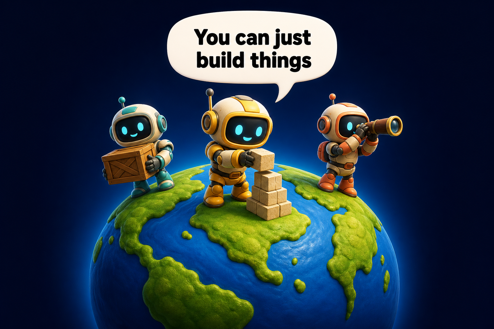
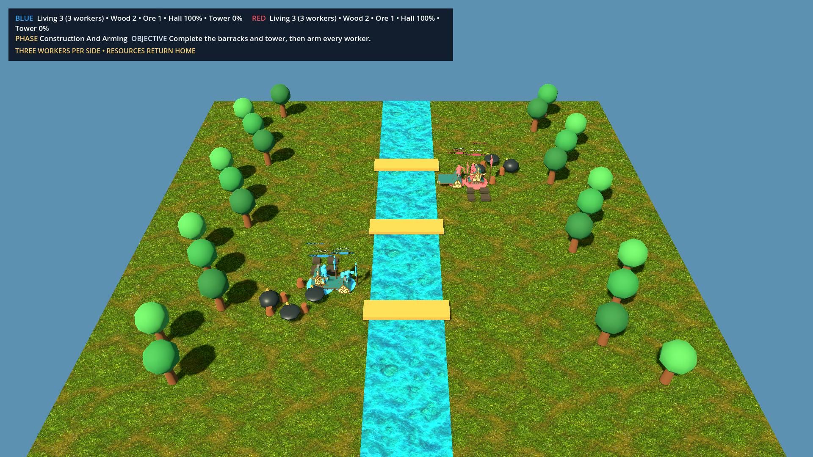
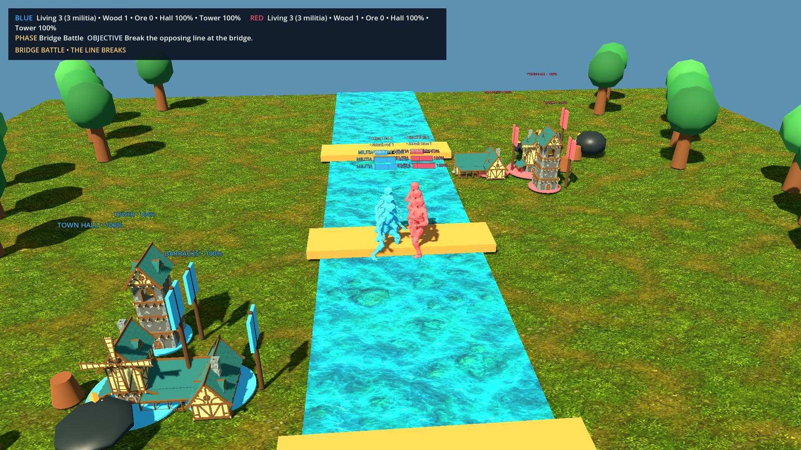
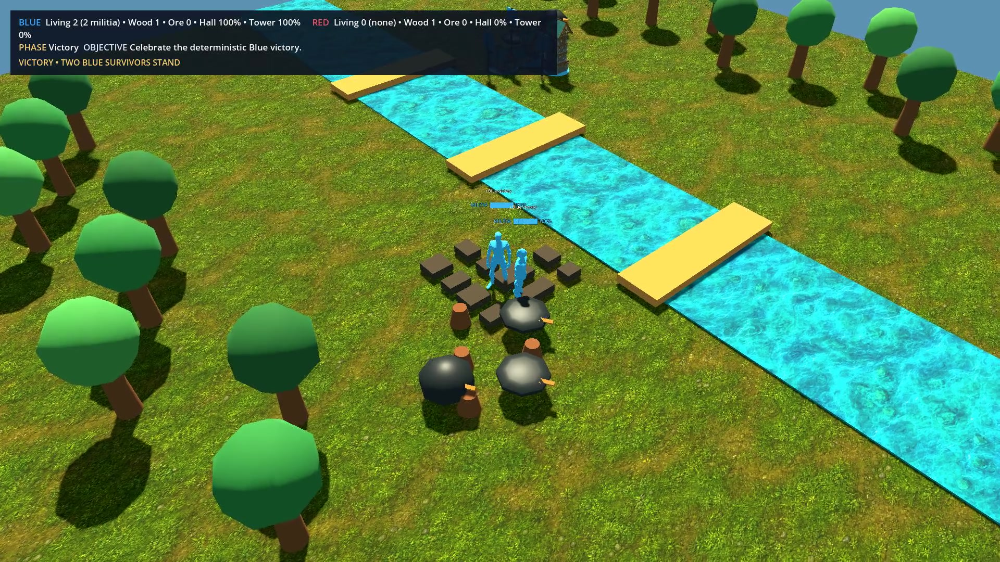
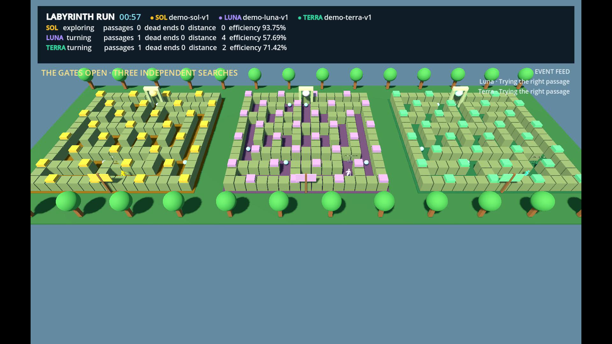
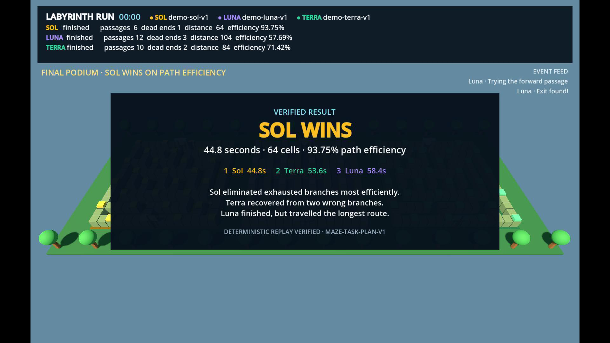
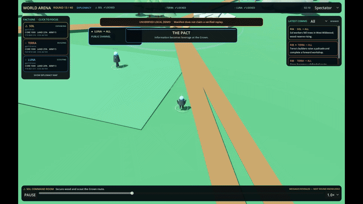

*WorldArena agents can gather, build, and explore—not just describe what they would do.*

# WorldEval

> Evaluate what an LLM does, not only what it says.

WorldEval is an evaluation framework for **intelligent agents in interactive, deterministic
worlds**. Its first environment is **WorldArena**, a 3D agent-arena platform where independently
configured models receive partial observations, submit high-level plans, and live with the
economic, physical, and social consequences inside an authoritative Godot simulation.
Its Controller Lab spans solo curricula and control games, symmetric two-agent games, and
three-agent Relay/Free-for-All games. Agents receive participant-visible observations and emit
strict JSON through the provider-shaped path.

The LLM is the strategist; it never controls coordinates, physics, damage, resources, or scoring.
Godot resolves the world, while FastAPI validates plans, enforces budgets, and records evidence.

**Status:** working research prototype. Participant-view browser presentation, authority-derived
evaluation, sealed replay, and versioned solo/duo/trio managed runtimes are implemented. No
official live-model leaderboard, provider comparison, or completed benchmark season is published.

**Playback and publication:** native gameplay video is reconstructed from a verified replay by
Godot Movie Maker, then encoded locally by FFmpeg. The Pages gallery has solo, seat-swapped 1v1,
and Sol/Luna/Terra trio slots with local coming-soon posters; no external video ID is invented or
published by this repository.

The visual stack now uses a reviewed Quaternius Medieval Village CC0 building subset, Kenney's CC0
Adventure UI vectors, FastNoiseLite terrain variation, WorldEnvironment lighting, and
NavigationAgent3D movement hooks. Terrain3D and LimboAI are pinned and loaded behind deterministic
presentation-only boundaries. The newer Quaternius MegaKit and Mixamo clips retain their official
interactive-download steps; import contracts are included, but no gated asset was bypassed.

> [!NOTE]
> This repository is independent of the 2026 paper
> [*WorldArena: A Unified Benchmark for Evaluating Perception and Functional Utility of Embodied
> World Models*](https://arxiv.org/abs/2602.08971). That work evaluates embodied world models;
> this project evaluates the behaviour of competing LLM agents.

## Why this framework exists

Static question-answer evaluations can measure knowledge and reasoning in a single response. They
cannot show whether a model can maintain a plan, recover after failure, manage scarce resources,
coordinate with unfamiliar agents, detect deception, or turn language into useful action over time.

WorldEval tests those capabilities through environments such as WorldArena. In the competitive
arena, a model must act under partial observability and fixed budgets while two other models change
the world at the same time. Every claim can be checked against typed actions and simulator events
rather than an LLM judge.

This makes the benchmark useful for studying:

| Capability | Observable evidence |
|---|---|
| Long-horizon planning | Objective completion, multi-round coherence, preparation, and recovery |
| Resource and combat decisions | Productive spending, waste, supply uptime, losses, and retreats |
| Social intelligence | Executed trades, honoured pacts, calibrated trust, coordination, and betrayal outcomes |
| Delegation | Specialist use, accepted advice, contradictions, token cost, and progress per budget |
| Reliability | Valid actions, timeouts, fallbacks, impossible orders, and protocol compliance |

WorldEval currently measures **strategic agent behaviour** through two WorldArena research
surfaces. The older Arena evaluates long-horizon strategy from visibility-filtered semantic
observations. The LLM Controller embodiment path uses hybrid participant observations: filtered
semantics plus the participant's own camera pixels. Neither surface evaluates robot safety, and
neither gives an agent spectator vision or hidden authority coordinates.

### Embodied controller pilot

The managed solo pilot adds a smaller physical-world test: a model selects a visible milestone,
then the Godot operator must actually turn, walk, gather, carry, and build before it can choose
again. A useful illustrative dependency check is refuelling a car: “the station is five minutes
away” is not enough to choose walking when the objective is to drive the car there. WorldArena
records these prerequisite chains so they can be evaluated as physical-world understanding rather
than accepted as plausible language alone. This is an illustrative test design, not a claim about
the failure of any particular model.

## Run the Mini RTS Demo

**WorldArena: Mini RTS** is the golden demo path: a compact, deterministic `rts-skirmish-v0`
where Blue and Red begin with one worker, harvest persistent wood and ore nodes, return loads,
unlock and arm the same three workers as militia, then fight at the bridge. The locked cinematic
story ends with Blue pursuing the final Red fighter, destroying Red's tower and Town Hall, and
celebrating a deterministic victory. Godot remains the movement, combat, scoring, and replay
authority.

[Watch the 150-second native gameplay capture](godot/showcases/rts_skirmish/rts-skirmish-broadcast.mp4)



*Opening economy — first-class workers fan out to persistent resources before returning their loads.*



*Bridge battle — animated Blue and Red Y Bots exchange attacks while the public HUD tracks health and objectives.*



*Deterministic finish — two Blue survivors stand in the destroyed Red stronghold as the victory HUD closes the replay.*

Start the local Controller Lab and choose **Run RTS Skirmish** under **Pre-run saves**. The public
tactical broadcast is for the audience only; it is explicitly separate from each agent’s
participant-visible observation.

```bash
# terminal 1, from the repository root
.venv/bin/uvicorn genesis_arena.main:app --host 127.0.0.1 --port 8000

# terminal 2
cd dashboard && pnpm dev
```

Open the displayed local URL and click **Run RTS Skirmish**. The dashboard plays the sealed,
authority-verified 150-second broadcast. Use the Timeline, Result, Evaluation, and Replay tabs to
inspect the public story and verification metadata.

## Run the Labyrinth Run Highlight

Choose **Play Labyrinth Run** under **Pre-run saves**. Sol, Luna, and Terra race separate copies of
the same maze at equal speed. The broadcast keeps the model-colour key visible and closes with the
verified podium and winner explanation.

### Screenshots

The repository keeps permanent captures in the
[WorldArena screenshot collection](docs/screenshots/README.md).





## Run the Crossroads Conquest Highlight

Choose **Run Crossroads Conquest** as the third **Pre-run saves** card. The dashboard opens the
sealed 180-second `crossroads-conquest-v0` broadcast without creating a run or contacting a model.
Its fixed seed is `424242`: Sol eliminates Terra after Terra's counter-raid critically weakens Sol,
then Luna waits for the authoritative elimination event before attacking and winning.

Run, Timeline, and Result use the cached public manifest projection. Evaluation and Replay load the
allow-listed evaluation projection only when opened. The replay file remains server-side; there is
no public replay-download route.

## How a match works

1. Godot freezes a world state and gives each faction a private, visibility-filtered observation.
2. Eligible specialist advisors run, then all three Commanders plan concurrently.
3. Plans are canonicalized and sealed with commit hashes before any plan is revealed.
4. Godot verifies and resolves all accepted actions through the same fixed-tick round.
5. Events, receipts, usage, state hashes, and evidence are written for scoring and replay.

This commit/lock/reveal protocol prevents provider latency from granting initiative. Rendering,
camera movement, and playback speed cannot change a result.

The compact arena contains 13 districts, finite resources, fogged scouting, persistent gathering,
worker-scaled construction and repair, supply lines, technology, walls, towers, armies, siege,
public/private messages, atomic trades, non-binding pacts, and visible pact violations. The only
victory is the last surviving stronghold. Reaching the 120-round cap truncates the run and publishes
diagnostic standings without declaring a winner.

## Evaluation methodology

The competitive result is the Godot-derived placement. A separate, versioned **WorldEval Score**
explains behaviour and never changes the winner:

| Category | Weight |
|---|---:|
| Objective control | 35% |
| Planning and adaptation | 20% |
| Resource and combat efficiency | 15% |
| Social intelligence | 15% |
| Delegation and cognition | 10% |
| Reliability and safety | 5% |

Scores fail closed when required evidence is missing. Each category retains its measurements and
supporting action/event IDs; best decisions and largest failures are selected by deterministic
three-round outcome deltas. **No LLM judge is used.**

Results from different cognition tracks are kept separate:

| Track | Model access | Use |
|---|---|---|
| Standard | One Commander call per faction per round | Direct model comparison |
| Agentic | Commander plus bounded same-model specialists under one shared budget | Delegation and context management |
| Open Teams | Configurable or mixed-model teams | Experiments only; no shared leaderboard |

The included season scheduler freezes the model snapshot, prompt, rules, map, tools, budgets, and
deadlines. It creates 33 deterministic seeds with all three seat rotations: **99 scored matches plus
one unscored championship showcase**. Aggregation reports per-seed results, pairwise outcomes,
placement, category scores, and 95% win-rate confidence intervals. Batch execution of the schedule
is not yet included.

## Research foundations and differences

WorldEval combines lessons from prior work rather than treating any one final score as sufficient:

| Research | Lesson adopted here | WorldEval's focus |
|---|---|---|
| [ALEM](https://arxiv.org/abs/2606.08340) | Separate coordination from base task skill | Mixed cooperation and competition between independently scored Commanders |
| [Melting Pot 2.0](https://arxiv.org/abs/2211.13746) | Test generalization to unfamiliar social partners | Natural-language negotiation whose value is tied to later physical outcomes |
| [Neural MMO](https://arxiv.org/abs/2308.15802) | Vary opponents and test robustness | Seat-balanced schedules and per-opponent aggregates |
| [BALROG](https://arxiv.org/abs/2411.13543) | Keep fine-grained agentic metrics beyond success | Evidence-linked planning, economy, social, cognition, and reliability measures |
| [Cattle Trade](https://arxiv.org/abs/2605.14537) | Preserve behavioural traces beyond wins | Negotiation coupled to territory, logistics, construction, and combat |

The distinctive question is not simply “can the model win a game?” It is: **can an LLM deploy
planning, adaptation, negotiation, delegation, and resource discipline together—and can every
consequence be reproduced and audited?**

## Run locally

Requirements:

- Python 3.9+
- Godot 4.5 stable or a compatible Godot 4 build
- FFmpeg for saved native replay and export (`brew install ffmpeg` on macOS)
- macOS for the included double-click launcher; the Python backend and Godot project are portable

From the repository root:

```bash
./run_worldarena.command
```

Choose **Pre-run saves** for the packaged highlights, or **Live games** to configure a
provider-backed session. Live keys stay in backend process memory and are never written to source,
logs, replays, `.env`, or Godot.

To start the processes manually:

```bash
python3 -m venv .venv
source .venv/bin/activate
python -m pip install -e ".[dev]"
genesis-arena
```

The installed Python commands temporarily retain their legacy `genesis-*` names for compatibility;
see [`docs/NAMING.md`](docs/NAMING.md).

Open <http://127.0.0.1:8000/>. The managed episode/series service starts the appropriate versioned
Godot authority. To inspect the Godot project separately:

```bash
/Applications/Godot.app/Contents/MacOS/Godot --path godot
```

The browser preview is presentation-only: a newest-frame-only participant JPEG stream is separated
from decisions and replay, while verified PNG snapshots remain the reliability fallback.

## Native replay and video

Completed Controller Lab runs are sealed before native playback is produced. The replay archive
selects the Movie Maker verifier for `llm-controller/0.1.0`, `0.2.0`, or `0.3.0`, reconstructs only
the selected participant view at 30 FPS, and invokes local FFmpeg for H.264/yuv420p output with
`+faststart`. Install FFmpeg first; native replay is reported unavailable when it is not configured,
while evidence and deterministic verification remain usable.

The existing MVP renderer can also render verified embodiment replay inputs directly:

```bash
.venv/bin/python scripts/render_embodiment_mvp_demo.py --help
```

Local run bundles and exported video remain ignored. Upload and Pages video IDs require explicit
user authorization. Native embodiment video uses Godot Movie Maker plus FFmpeg—never Remotion.

The older Arena highlight command remains a separate presentation path:

```bash
./render_highlight_replay.command
```

See [`docs/HIGHLIGHT_EXPORT.md`](docs/HIGHLIGHT_EXPORT.md) for the command-line options.

### GitHub action preview

This 20-second cut is taken from the same deterministic showcase and keeps the
negotiation, Crown clash, and reversal beats visible without requiring a local render:



## Verify

For the older Arena fast verification pass:

```bash
./run_fast_deterministic_tests.command
```

Set `WORLD_ARENA_FAST_ROUNDS=12` if you want a slightly longer batch smoke while keeping it fully
deterministic.

Run the Python contract, concurrency, privacy, scoring, and scheduling tests:

```bash
.venv/bin/pytest -q
```

Run the focused embodiment and frozen Duel suites, then validate both dashboard builds:

```bash
.venv/bin/pytest -q tests/embodiment
.venv/bin/pytest -q tests/duel

cd dashboard
pnpm install --frozen-lockfile
pnpm lint
pnpm test
pnpm typecheck
pnpm build
pnpm build:pages
```

The Pages build uses the `/WorldArena/` base. Optional repository variables
`YOUTUBE_SOLO_ID`, `YOUTUBE_DUEL_ID`, and `YOUTUBE_TRIO_ID` enable privacy-enhanced YouTube
facades only after a visitor presses play. Without them, all three local poster fallbacks remain.

Run the deterministic simulation and Controller Lab regression loop:

```bash
/Applications/Godot.app/Contents/MacOS/Godot \
  --headless --path godot \
  --script res://scripts/arena/simulation/arena_headless_runner.gd

/Applications/Godot.app/Contents/MacOS/Godot \
  --headless --path godot \
  --quit-after 8000 -- \
  --arena-offline-demo --arena-test-rounds=4 --arena-quit-after-test
```

Generate a frozen season schedule after replacing the example model IDs and hashes with resolved
production metadata:

```bash
genesis-season-schedule docs/season-spec.example.json runs/season-schedule.json
```

## Architecture

```text
Live model adapters / Pre-run showcase inputs
                 ↓
WorldEval / FastAPI: isolation · strict JSON · budgets · neutral fallback · safe projections
                 ↓  llm-controller/0.1.0 · 0.2.0 · 0.3.0
WorldArena / Godot: sole authority · participant observations · receipts · checkpoints
                 ↓
Solo / fixed-window duo / fixed-window trio simulation
                 ↓
Participant-only preview · authority evaluation · verified native replay
```

Only the deterministic simulation changes world state. Python may reject malformed output but
cannot award territory, resources, damage, or victory.

## Repository guide

| Path | Purpose |
|---|---|
| [`backend/genesis_arena/embodiment/`](backend/genesis_arena/embodiment/) | Demo/live provider boundary, managed runtimes, safe evaluation, and replay archives |
| [`godot/scripts/embodiment/`](godot/scripts/embodiment/) | Solo, duo, and trio authority plus participant presentation and versioned replay |
| [`game/embodiment_protocol_packages/`](game/embodiment_protocol_packages/) | Immutable additive `llm-controller` protocol packages and registry |
| [`dashboard/`](dashboard/) | Local Controller Lab and `/WorldArena/` GitHub Pages site |
| [`backend/genesis_arena/arena/`](backend/genesis_arena/arena/) | Protocol, runtime, artifacts, evaluator, and season scheduler |
| [`godot/scripts/arena/`](godot/scripts/arena/) | Authoritative simulation, controller, and presentation |
| [`godot/data/arena/`](godot/data/arena/) | Versioned map and benchmark contract |
| [`game/arena_actions.json`](game/arena_actions.json) | Typed action and cognition contract |
| [`tests/`](tests/) | Unit, adversarial, privacy, concurrency, protocol, and scoring tests |
| [`docs/architecture.md`](docs/architecture.md) | Authority boundaries and round protocol |
| [`docs/NAMING.md`](docs/NAMING.md) | WorldEval and WorldArena naming conventions |
| [`feature.md`](feature.md) | Full product, rules, evaluation, and implementation specification |

WorldEval uses WorldArena as a controlled test of foundational agent behaviour. Strong performance
does not show that a model is safe to control a real robot or operate without human oversight.
