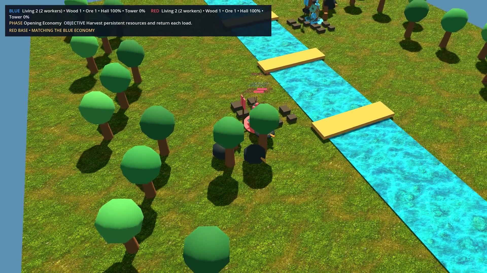
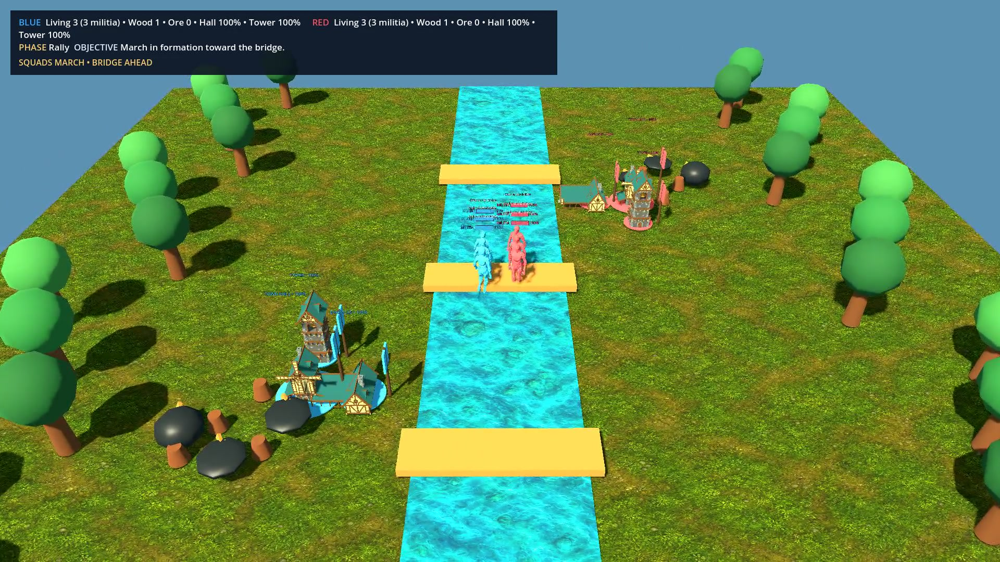
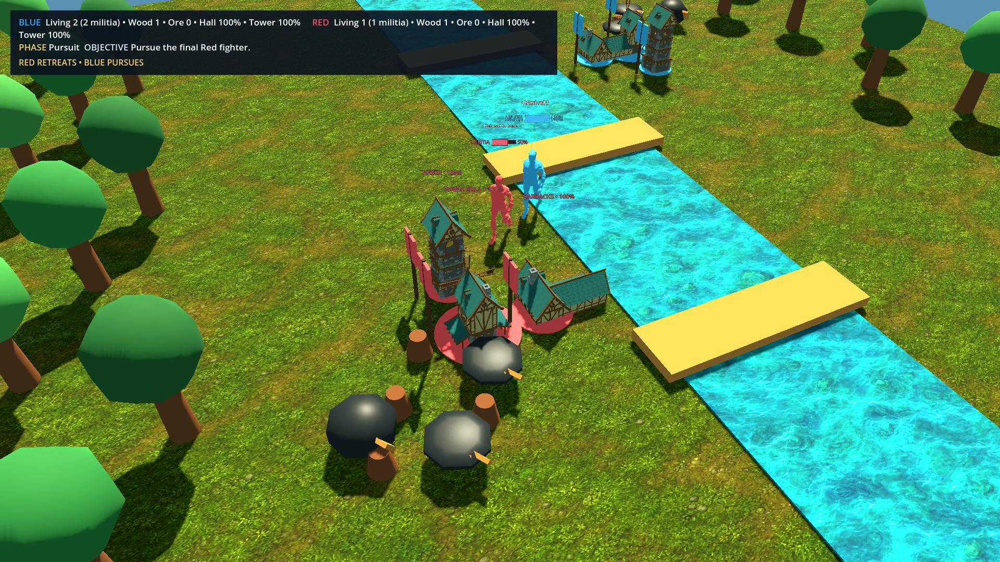
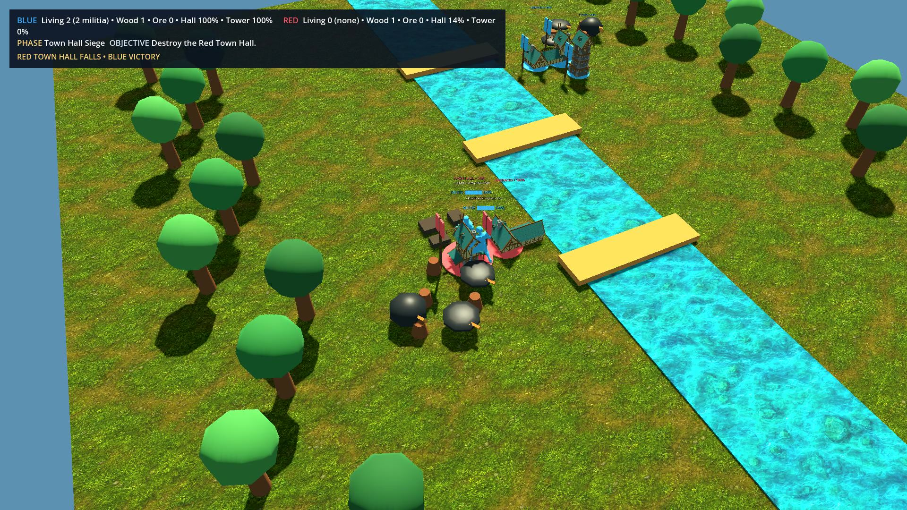
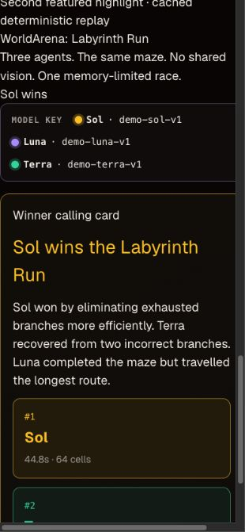
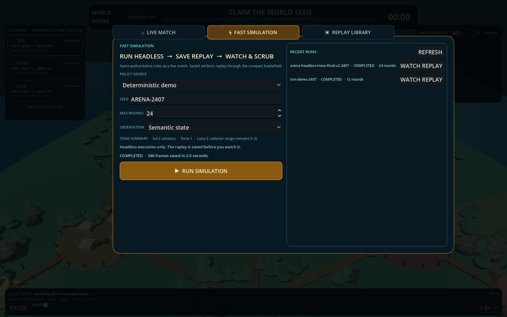
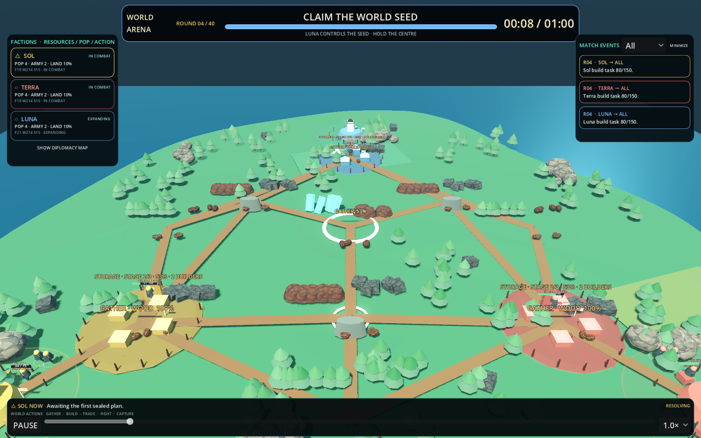
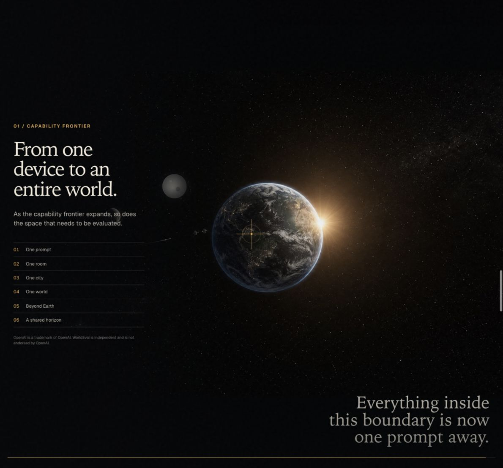

# WorldArena Screenshots

This page collects repository-owned captures of implemented WorldArena gameplay and interfaces.
Images are checked into `docs/screenshots` so README and documentation pages do not depend on
temporary render paths or third-party hosting.

## Mini RTS Skirmish

### Persistent resource economy

Workers walk to the pre-existing tree and ore fields, harvest for a visible duration, carry their
loads home, and unlock the rest of each three-unit faction.

### Rally and bridge battle

The same workers become militia, form squads, march toward the bridge, and exchange animated hits
under public health bars and safe task summaries.

### Retreat, siege, and victory

Red's final fighter retreats, the two surviving Blue militia counterattack, and the match ends by
destroying Red's tower and Town Hall.

## Labyrinth Run

### Three-agent race

Sol, Luna, and Terra race physically separate copies of the same maze. The broadcast keeps the
model-colour key and live spatial-reasoning metrics visible throughout the run.

### Verified winner calling card

The native broadcast closes with the final podium, winning strategy, finish time, travelled cells,
and path efficiency.

### Responsive Controller Lab

The same model key, winner rationale, and podium are available in the Controller Lab on narrow
screens.

## Controller and marketing surfaces

### Simulation Lab

### Artifact replay

### Marketing site

